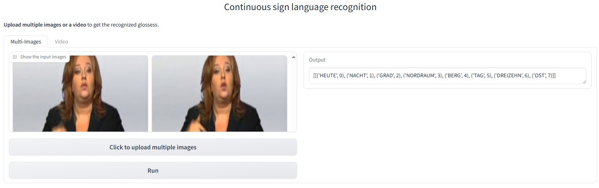

# SEN_CSLR
This repo holds codes of the paper: Self-Emphasizing Network for Continuous Sign Language Recognition.(AAAI 2023) [[paper]](https://arxiv.org/abs/2211.17081)

This repo is based on [VAC (ICCV 2021)](https://openaccess.thecvf.com/content/ICCV2021/html/Min_Visual_Alignment_Constraint_for_Continuous_Sign_Language_Recognition_ICCV_2021_paper.html). Many thanks for their great work!

(**Update on 2025/01/28**) We release a demo for Continuous sign language recognition that supports multi-images and video inputs! You can watch the demo video to watch its effects, or deploy a demo locally to test its performance. 

https://github.com/user-attachments/assets/a7354510-e5e0-44af-b283-39707f625a9b

<div align=center>
The web demo video
</div>

## Prerequisites

- This project is implemented in Pytorch (>1.8). Thus please install Pytorch first.

- ctcdecode==0.4 [[parlance/ctcdecode]](https://github.com/parlance/ctcdecode)，for beam search decode.

- sclite [[kaldi-asr/kaldi]](https://github.com/kaldi-asr/kaldi), install kaldi tool to get sclite for evaluation. After installation, create a soft link toward the sclite: 
  `mkdir ./software`
  `ln -s PATH_TO_KALDI/tools/sctk-2.4.10/bin/sclite ./software/sclite`

- [SeanNaren/warp-ctc](https://github.com/SeanNaren/warp-ctc) for ctc supervision.

## Implementation
The implementation for the SSEM (line 47) and TSEM (line 23) is given in [./modules/resnet.py](https://github.com/hulianyuyy/SEN_CSLR/blob/main/modules/resnet.py).  

They are then equipped with the BasicBlock in ResNet in line 93 [./modules/resnet.py](https://github.com/hulianyuyy/SEN_CSLR/blob/main/modules/resnet.py).

We later found that a multi-scale architecture could perform on par with what we report in the paper for TSEM, and thus implement it as such.

## Data Preparation
You can choose any one of following datasets to verify the effectiveness of SEN.

### PHOENIX2014 dataset
1. Download the RWTH-PHOENIX-Weather 2014 Dataset [[download link]](https://www-i6.informatik.rwth-aachen.de/~koller/RWTH-PHOENIX/). Our experiments based on phoenix-2014.v3.tar.gz.

2. After finishing dataset download, extract it. It is suggested to make a soft link toward downloaded dataset.   
   `ln -s PATH_TO_DATASET/phoenix2014-release ./dataset/phoenix2014`

3. The original image sequence is 210x260, we resize it to 256x256 for augmentation. Run the following command to generate gloss dict and resize image sequence.     

   ```bash
   cd ./preprocess
   python dataset_preprocess.py --process-image --multiprocessing
   ```

### PHOENIX2014-T dataset
1. Download the RWTH-PHOENIX-Weather 2014 Dataset [[download link]](https://www-i6.informatik.rwth-aachen.de/~koller/RWTH-PHOENIX-2014-T/)

2. After finishing dataset download, extract it. It is suggested to make a soft link toward downloaded dataset.   
   `ln -s PATH_TO_DATASET/PHOENIX-2014-T-release-v3/PHOENIX-2014-T ./dataset/phoenix2014-T`

3. The original image sequence is 210x260, we resize it to 256x256 for augmentation. Run the following command to generate gloss dict and resize image sequence.     

   ```bash
   cd ./preprocess
   python dataset_preprocess-T.py --process-image --multiprocessing
   ```

### CSL dataset

1. Request the CSL Dataset from this website [[download link]](https://ustc-slr.github.io/openresources/cslr-dataset-2015/index.html)

2. After finishing dataset download, extract it. It is suggested to make a soft link toward downloaded dataset.   
   `ln -s PATH_TO_DATASET ./dataset/CSL`

3. The original image sequence is 1280x720, we resize it to 256x256 for augmentation. Run the following command to generate gloss dict and resize image sequence.     

   ```bash
   cd ./preprocess
   python dataset_preprocess-CSL.py --process-image --multiprocessing
   ``` 

### CSL-Daily dataset

1. Request the CSL-Daily Dataset from this website [[download link]](http://home.ustc.edu.cn/~zhouh156/dataset/csl-daily/)

2. After finishing dataset download, extract it. It is suggested to make a soft link toward downloaded dataset.   
   `ln -s PATH_TO_DATASET ./dataset/CSL-Daily`

3. The original image sequence is 1280x720, we resize it to 256x256 for augmentation. Run the following command to generate gloss dict and resize image sequence.     

   ```bash
   cd ./preprocess
   python dataset_preprocess-CSL-Daily.py --process-image --multiprocessing
   ``` 

## Inference

### PHOENIX2014 dataset

| Backbone | Dev WER  | Test WER  | Pretrained model                                             |
| -------- | ---------- | ----------- | --- |
| Baseline | 21.2%      | 22.3%       |  --- | 
| ResNet18 | 19.5%      | 21.0%       | [[Baidu]](https://pan.baidu.com/s/1EcvdftTPwP6stbgB7C0v3Q) (passwd: jnii)<br />[[Google Drive]](https://drive.google.com/file/d/15k17Cz5oc36bNNSfmmTDpvtSJgr1gYOo/view?usp=share_link) |

### PHOENIX2014-T dataset

| Backbone | Dev WER  | Test WER  | Pretrained model                                             |
| -------- | ---------- | ----------- | --- |
| Baseline | 21.1%      | 22.8%       |  --- | 
| ResNet18 | 19.3%      | 20.7%       | [[Baidu]](https://pan.baidu.com/s/1_k6OML-exuQZO8sDzuD-5A) (passwd: kqhx)<br />[[Google Drive]](https://drive.google.com/file/d/1RnmtlmtssLbCPI3KyMoIIcJQbYy5xUrb/view?usp=share_link) |

### CSL-Daily dataset

| Backbone | Dev WER  | Test WER  | Pretrained model                                            |
| -------- | ---------- | ----------- | --- |
| Baseline | 32.8%      | 32.3%       |  --- | 
| ResNet18 | 31.1%      | 30.7%       | [[Baidu]](https://pan.baidu.com/s/1bARLXmEC-PlHdVU8BGx_7Q) (passwd: xkhu)<br />[[Google Drive]](https://drive.google.com/file/d/1uTbxI3fVM_66F8TCr0M8x5mWpi3FCz0W/view?usp=share_link) |

​	To evaluate the pretrained model, run the command below：   
`python main.py --device your_device --load-weights path_to_weight.pt --phase test`

### Training

The priorities of configuration files are: command line > config file > default values of argparse. To train the SLR model, run the command below:

`python main.py --device your_device`

Note that you can choose the target dataset from phoenix2014/phoenix2014-T/CSL/CSL-Daily in line 3 in ./config/baseline.yaml.

For CSL-Daily dataset, You may choose to reduce the lr by half from 0.0001 to 0.00005, change the lr deacying rate (gamma in the 'optimizer.py') from 0.2 to 0.5, and disable the temporal resampling strategy (comment line 121 in dataloader_video.py).
 
### Test with one video input
Except performing inference on datasets, we provide a `test_one_video.py` to perform inference with only one video input. An example command is 

`python test_one_video.py --model_path /path_to_pretrained_weights --video_path /path_to_your_video --device your_device`

The `video_path` can be the path to a video file or a dir contains extracted images from a video.

Acceptable paramters:
- `model_path`, the path to pretrained weights.
- `video_path`, the path to a video file or a dir contains extracted images from a video.
- `device`, which device to run inference, default=0.
- `language`, the target sign language, default='phoenix', choices=['phoenix', 'csl'].
- `max_frames_num`, the max input frames sampled from an input video, default=360.

### Demo
We provide a demo to allow deploying continuous sign language recognition models locally to test its effects. The demo page is shown as follows.
<div align=center>

<h4> The page of our demo</h4>
</div>
The demo video can be found in the top of this page. An example command is 

`python demo.py --model_path /path_to_pretrained_weights --device your_device`

Acceptable paramters:
- `model_path`, the path to pretrained weights.
- `device`, which device to run inference, default=0.
- `language`, the target sign language, default='phoenix', choices=['phoenix', 'csl'].
- `max_frames_num`, the max input frames sampled from an input video, default=360.

After running the command, you can visit `http://0.0.0.0:7862` to play with the demo. You can also change it into an public URL by setting `share=True` in line 176 in `demo.py`.

### Citation

If you find this repo useful in your research works, please consider citing:

```latex
@inproceedings{hu2023self,
  title={Self-Emphasizing Network for Continuous Sign Language Recognition},
  author={Hu, Lianyu and Gao, Liqing and Liu, Zekang and Feng, Wei},
  booktitle={Thirty-seventh AAAI conference on artificial intelligence},
  year={2023},
}
```